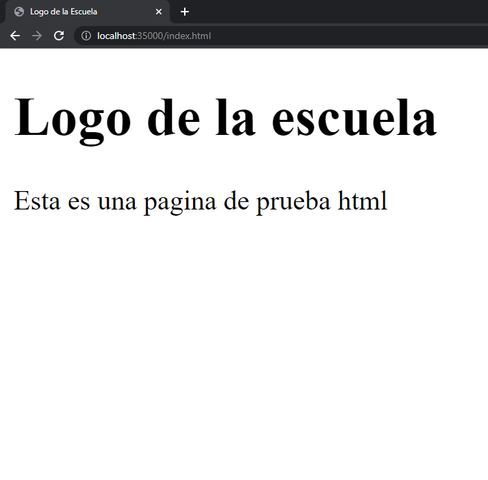
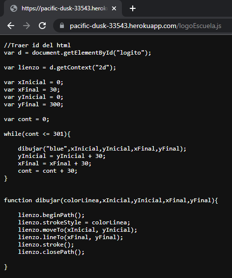
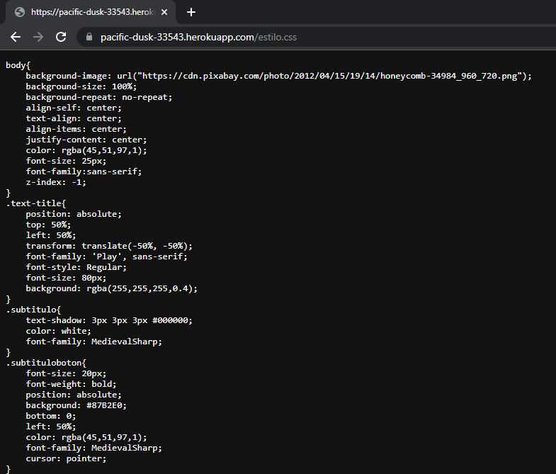
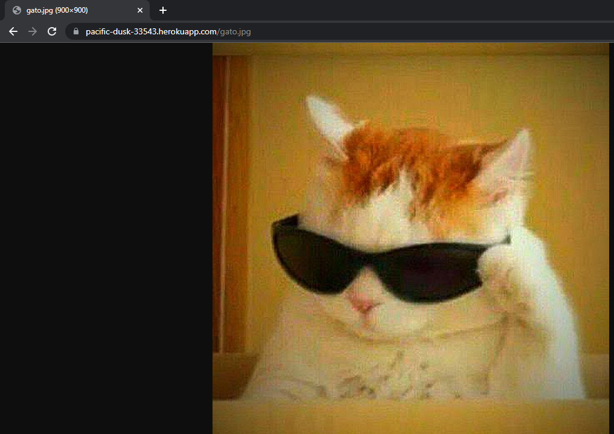
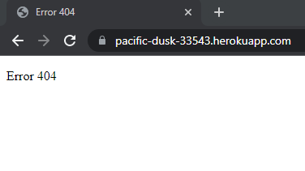

# Networking
## ARSW
### Autor

- Juan Monroy

### Fecha
- 17 Junio 2022

## Pagina en Heroku
[](https://pacific-dusk-33543.herokuapp.com/index.html)


## Funcionalidad
### Html


### JavaScript


### Css


### Imagen


### Pagina no existente


### Ejecutar el programa Localmente
```
java -cp "./target/classes" HttpServerController
```
### Links para probar el programa en Heroku
```
https://pacific-dusk-33543.herokuapp.com/estilo.css
https://pacific-dusk-33543.herokuapp.com/gato.jpg
https://pacific-dusk-33543.herokuapp.com/index.html
https://pacific-dusk-33543.herokuapp.com/logoEscuela.js
```

### Generar JavaDoc
```
mvn javadoc:javadoc
```
