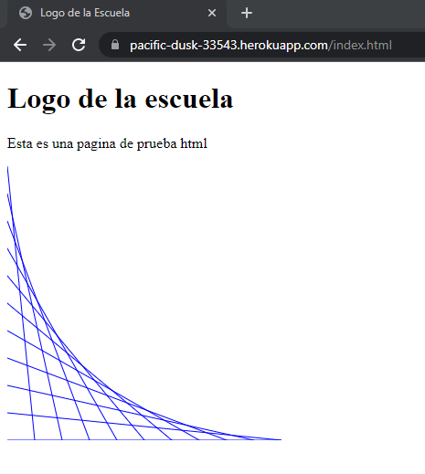

# Networking
## ARSW
### Autor

- Juan Monroy

### Fecha
- 17 Junio 2022

## Pagina en Heroku
[]([https://proyecto-solidaridadescuela.herokuapp.com/](https://pacific-dusk-33543.herokuapp.com/index.html))


## Funcionalidad
### Html


### JavaScript


### Css


### Imagen


### Ejecutar el programa
```
java -cp "./target/classes" HttpServerController
```
### Links para probar el programa
```
localhost:35000/estilo.css
localhost:35000/gato.jpg
localhost:35000/index.html
localhost:35000/logoEscuela.js
```

### Generar JavaDoc
```
mvn javadoc:javadoc
```
